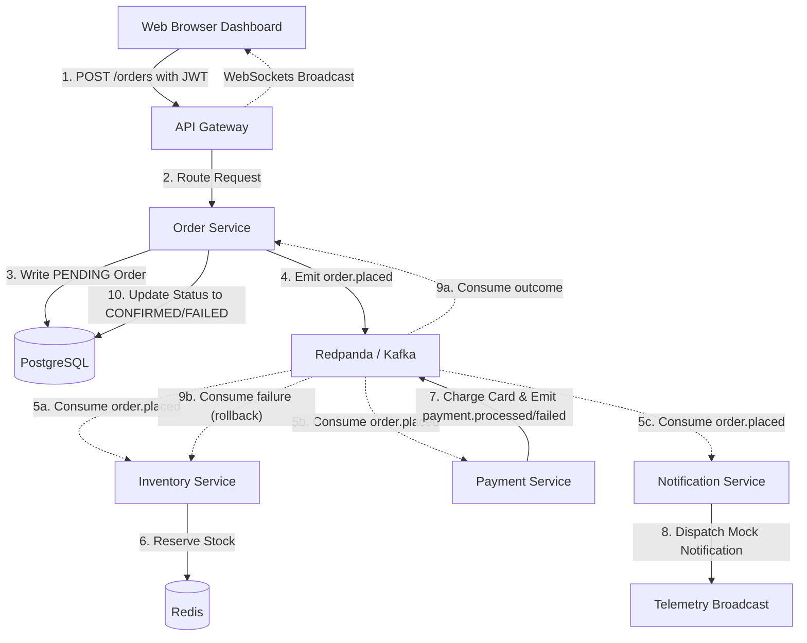

# Distributed Event-Driven E-Commerce Platform

A production-grade, event-driven microservices platform demonstrating asynchronous transaction coordination, real-time telemetry streaming, and the Saga Pattern (Compensating Transactions).

This project features a **hybrid driver engine** designed to run either in a production containerized environment (Redpanda, PostgreSQL, Redis) or as a zero-dependency local simulation using HTTP webhook routing and in-memory datastores.

---

## Architecture Diagram

The diagram below details the transaction lifecycle when a user initiates a `POST /orders` request:



---

## Key Design Patterns & Features

1. **The Saga Pattern (Choreography-based):** 
   - When an order is placed, stock is immediately reserved in the `Inventory Service` (stock decrements).
   - If the `Payment Service` succeeds, the order status progresses to `CONFIRMED`.
   - If the payment fails, the `Payment Service` emits a `payment.failed` event. The `Inventory Service` consumes this event and performs a **compensating transaction**, restoring the reserved stock (stock increments).
2. **Real-time Observability Dashboard:**
   - A single-page, dark-mode web panel connects to the Gateway via WebSockets (Socket.io). 
   - A live microservice network diagram lights up and pulses showing active communication lines as messages travel through the event bus.
3. **Resilient Local Mock Mode:**
   - If Redpanda, Redis, or PostgreSQL are offline, services automatically transition to an in-memory SQL database (arrays), in-memory Redis catalog (maps), and HTTP webhook routing.

---

## Directory Structure

```
├── README.md
├── docker-compose.yml           # Production Docker Stack
├── package.json                 # Root script configurations
├── start-local.js               # Concurrently runs all services locally
├── validate-flow.js             # End-to-end automated verification script
├── shared/
│   └── event-bus.js             # Shared EventBus abstraction
├── gateway/                     # Web Dashboard, Auth proxy, WebSockets
├── order-service/               # Postgres Order service
├── inventory-service/           # Redis Stock service
├── payment-service/             # Card charging simulation
└── notification-service/        # Email dispatcher simulation
```

---

## Setup & Running the Project

### Option A: Local Run (No Docker required - Zero Cost)

Runs the stack in **Mock Webhook Mode** using local processes, an in-memory database, and in-memory Redis.

1. Install dependencies from the project root:
   ```bash
   npm install
   ```
2. Start all microservices concurrently:
   ```bash
   npm run start:local
   ```
3. Open your browser and navigate to:
   **[http://localhost:3000](http://localhost:3000)**

---

### Option B: Production Containerized Stack (Requires Docker)

Runs the full, production-grade stack including Redpanda Broker, Redpanda Console UI, PostgreSQL, and Redis.

1. Build and start the container orchestration:
   ```bash
   docker compose up --build
   ```
2. Monitor streaming topics and messages in the **Redpanda Console**:
   **[http://localhost:8080](http://localhost:8080)**
3. Open your browser to access the E-Commerce Dashboard:
   **[http://localhost:3000](http://localhost:3000)**

---

## Live Tracing Demo Scenarios

### Scenario 1: Successful Order
1. Open the dashboard at `http://localhost:3000`.
2. Log in as **`alice`** (or any username).
3. Click **Order Now** on a product.
4. Observe the network chart:
   - `Order Service` pulses purple (pending database write).
   - Flow lines light up from `Order Service` -> `Redpanda` -> `Inventory` / `Payment` / `Notification`.
   - `Inventory` and `Payment` nodes turn green.
   - `Order Service` turns green (order status transitions to `CONFIRMED`).

### Scenario 2: Compensating Transaction Rollback
1. Log in using the username **`fail`** (forces the Payment engine to mock a card failure).
2. Click **Order Now** on a product.
3. Observe the network chart:
   - Inventory is immediately reserved (stock decrements in the left-hand panel).
   - `Payment Service` attempts charge, fails, and glows red.
   - `Payment Service` emits a `payment.failed` event.
   - `Inventory Service` consumes the event and rolls back (stock increments back to its previous value).
   - `Order Service` node turns red (order status transitions to `FAILED`).

---

## Service Configuration & Ports

| Service Name | Port | Primary Responsibility | Data Store |
| :--- | :--- | :--- | :--- |
| **API Gateway** | `3000` | Static asset hosting, JWT generation, proxy routes, WebSocket server. | N/A |
| **Order Service** | `3001` | Order registration and status transitions. | PostgreSQL (or Array) |
| **Inventory Service** | `3002` | Catalog stock reservation and rollbacks. | Redis (or Map) |
| **Payment Service** | `3003` | Charges card simulation with 1.5s latency. | N/A |
| **Notification Service** | `3004` | Event-driven customer notification logging. | N/A |
| **Redpanda Console** | `8080` | Web console for Kafka broker management. | Redpanda |
